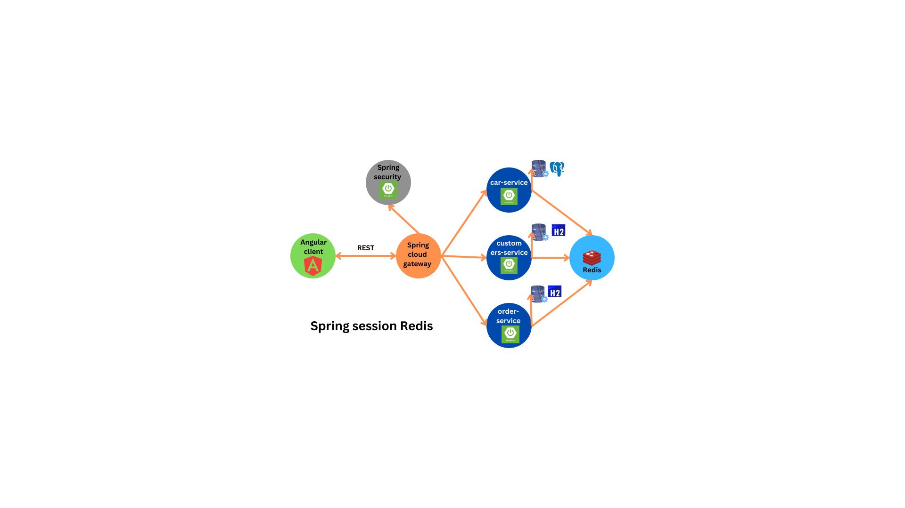

# Car Luxury Agency (CL Agency) Management System

Le projet a pour objectif de développer un système de gestion pour l'agence de voitures de luxe (CL Agency). L'agence se concentrera principalement sur la gestion des véhicules, des clients et des commandes. Une section du site présentera une liste des voitures disponibles, tandis que les utilisateurs pourront contacter l'agence pour passer des commandes.
## Architecture du Projet



Le projet repose principalement sur une architecture de microservices, comprenant les composants suivants :

- **gateway-service:** Service de passerelle pour la communication entre les microservices.
- **sec-service:** Service de gestion de l'authentification et de la sécurité.
- **cars-service:** Service gérant les informations sur les voitures disponibles.
- **customers-service:** Service dédié à la gestion des informations clients.
- **order-service:** Service responsable de la gestion des commandes.

La partie frontend du projet a été implémentée en Angular.

## Cars-Service: Approche Réactive avec Spring WebFlux

Dans le service Cars, j'ai adopté une approche réactive en utilisant Spring WebFlux. L'idée principale de mon projet est de tirer parti de la programmation réactive pour garantir des opérations asynchrones et non bloquantes, offrant ainsi une extensibilité et des performances optimales.

### Objectif

L'objectif de l'utilisation de Spring WebFlux est d'explorer les principes de la programmation réactive dans le cadre d'une application Spring Boot. En mettant l'accent sur les flux réactifs, Flux et Mono, ainsi que les opérations d'E/S non bloquantes, nous cherchons à créer une application réactive capable de gérer efficacement des opérations asynchrones et de réagir de manière événementielle.

### Points à Couvrir

Les points clés à couvrir dans cette approche réactive incluent les concepts suivants :
- **Reactive Streams:** Comprendre les flux réactifs et comment ils permettent de traiter les données de manière asynchrone.
- **Flux and Mono:** Exploration des types de données réactifs fournis par Spring WebFlux et comment les utiliser pour des opérations asynchrones.
- **I/O Non Bloquant:** Mise en œuvre d'E/S non bloquantes pour garantir que l'application peut traiter simultanément plusieurs requêtes sans bloquer le fil d'exécution.

### Démonstration

Pour illustrer l'application de ces concepts, le service Cars utilise une démonstration pratique de construction d'une application Spring Boot réactive. Cette démo met en avant la programmation asynchrone et événementielle pour une meilleure réactivité et une gestion optimale des ressources.
---
## Dépendances

### gateway-service
```xml
<dependency>
    <groupId>org.springframework.cloud</groupId>
    <artifactId>spring-cloud-starter-gateway</artifactId>
</dependency>
```
### sec-service
```xml
<dependencies>
    <dependency>
        <groupId>org.springframework.boot</groupId>
        <artifactId>spring-boot-starter-data-jpa</artifactId>
    </dependency>
    <dependency>
        <groupId>org.springframework.boot</groupId>
        <artifactId>spring-boot-starter-data-redis</artifactId>
    </dependency>

    <dependency>
        <groupId>org.springframework.session</groupId>
        <artifactId>spring-session-data-redis</artifactId>
    </dependency>
    <dependency>
        <groupId>org.webjars</groupId>
        <artifactId>bootstrap</artifactId>
        <version>5.2.3</version>
    </dependency>
    <dependency>
        <groupId>org.springframework.boot</groupId>
        <artifactId>spring-boot-starter-thymeleaf</artifactId>
    </dependency>
    <dependency>
        <groupId>org.springframework.boot</groupId>
        <artifactId>spring-boot-starter-security</artifactId>
    </dependency>
    <dependency>
        <groupId>org.springframework.boot</groupId>
        <artifactId>spring-boot-starter-web</artifactId>
    </dependency>

    <dependency>
        <groupId>com.h2database</groupId>
        <artifactId>h2</artifactId>
        <scope>runtime</scope>
    </dependency>
    <dependency>
        <groupId>org.projectlombok</groupId>
        <artifactId>lombok</artifactId>
        <optional>true</optional>
    </dependency>
    <dependency>
        <groupId>org.springframework.boot</groupId>
        <artifactId>spring-boot-starter-test</artifactId>
        <scope>test</scope>
    </dependency>
    <dependency>
        <groupId>org.springframework.security</groupId>
        <artifactId>spring-security-test</artifactId>
        <scope>test</scope>
    </dependency>
</dependencies>
```
### cars-service
```xml
<dependencies>
        <dependency>
            <groupId>org.springframework.boot</groupId>
            <artifactId>spring-boot-starter-validation</artifactId>
        </dependency>
		<dependency>
			<groupId>org.springframework.boot</groupId>
			<artifactId>spring-boot-starter-data-r2dbc</artifactId>
		</dependency>
		<dependency>
			<groupId>org.springframework.boot</groupId>
			<artifactId>spring-boot-starter-webflux</artifactId>
		</dependency>
		<dependency>
			<groupId>org.springframework</groupId>
			<artifactId>spring-jdbc</artifactId>
		</dependency> 

        <dependency>
            <groupId>org.springframework.boot</groupId>
            <artifactId>spring-boot-starter-data-redis</artifactId>
        </dependency>

        <dependency>
            <groupId>org.springframework.session</groupId>
            <artifactId>spring-session-data-redis</artifactId>
        </dependency> 
		<dependency>
			<groupId>org.springframework.boot</groupId>
			<artifactId>spring-boot-devtools</artifactId>
			<scope>runtime</scope>
			<optional>true</optional>
		</dependency>
		<dependency>
			<groupId>org.postgresql</groupId>
			<artifactId>postgresql</artifactId>
			<scope>runtime</scope>
		</dependency>
		<dependency>
			<groupId>org.postgresql</groupId>
			<artifactId>r2dbc-postgresql</artifactId>
			<scope>runtime</scope>
		</dependency>
		<dependency>
			<groupId>org.projectlombok</groupId>
			<artifactId>lombok</artifactId>
			<optional>true</optional>
		</dependency>
		<dependency>
			<groupId>org.springframework.boot</groupId>
			<artifactId>spring-boot-starter-test</artifactId>
			<scope>test</scope>
		</dependency>
		
		<dependency>
			<groupId>io.projectreactor</groupId>
			<artifactId>reactor-test</artifactId>
			<scope>test</scope>
		</dependency>
    </dependencies>
```

### customers-service && order-service
```xml
 <dependencies>
        <dependency>
            <groupId>org.springframework.boot</groupId>
            <artifactId>spring-boot-starter-data-jpa</artifactId>
        </dependency>
        <dependency>
            <groupId>org.springframework.boot</groupId>
            <artifactId>spring-boot-starter-data-redis</artifactId>
        </dependency>

        <dependency>
            <groupId>org.springframework.session</groupId>
            <artifactId>spring-session-data-redis</artifactId>
        </dependency>
        <dependency>
            <groupId>org.springframework.boot</groupId>
            <artifactId>spring-boot-starter-security</artifactId>
        </dependency>
        <dependency>
            <groupId>org.springframework.boot</groupId>
            <artifactId>spring-boot-starter-web</artifactId>
        </dependency>

        <dependency>
            <groupId>com.h2database</groupId>
            <artifactId>h2</artifactId>
            <scope>runtime</scope>
        </dependency>
        <dependency>
            <groupId>org.projectlombok</groupId>
            <artifactId>lombok</artifactId>
            <optional>true</optional>
        </dependency>
        <dependency>
            <groupId>org.springframework.boot</groupId>
            <artifactId>spring-boot-starter-test</artifactId>
            <scope>test</scope>
        </dependency>
        <dependency>
			<groupId>org.springframework.boot</groupId>
			<artifactId>spring-boot-devtools</artifactId>
			<scope>runtime</scope>
			<optional>true</optional>
		</dependency>
    </dependencies>
````


## Gestion des Sessions et des Messages avec Redis

Pour renforcer la gestion des sessions utilisateur et faciliter la communication entre les services, j'ai choisi d'utiliser Redis, une base de données clé-valeur en mémoire. Cette décision vise à garantir une expérience utilisateur cohérente et à favoriser la communication asynchrone entre les différents composants du système.

### Sessions Utilisateur avec Redis

La gestion des sessions utilisateur est cruciale pour assurer une expérience utilisateur fluide et sécurisée. En utilisant Redis, nous stockons les informations de session de manière efficace et évolutive. Cela permet une gestion transparente des états de session, même dans un environnement distribué.

### Communication Asynchrone entre Services

La communication entre les services est un aspect essentiel de l'architecture microservices. Redis sert de canal de communication central pour faciliter les échanges de messages entre les services. Cette approche asynchrone permet une intégration plus souple et réactive entre les différents composants du système.

### Configuration dans le Projet

Pour intégrer Redis dans le projet, assurez-vous d'avoir les dépendances appropriées dans le fichier de configuration de chaque service. Voici un exemple de dépendance pour le support Redis dans un projet Spring Boot :

```xml
<dependency>
    <groupId>org.springframework.boot</groupId>
    <artifactId>spring-boot-starter-data-redis</artifactId>
</dependency>
````


# Configuration de Spring Cloud Gateway

Dans le cadre de notre architecture microservices, nous utilisons Spring Cloud Gateway pour gérer les requêtes et diriger le trafic vers les services appropriés. La configuration suivante dans le fichier de configuration `application.yml` définit les règles de routage pour plusieurs services du système.

## Global CORS Configuration

```yaml
spring:
  cloud:
    gateway:
      globalcors:
        cors-configurations:
          "[/**]":
            allowedOrigins: "*"
            allowedMethods:
              - GET
              - POST
              - PUT
              - DELETE
            allowed-headers: "*"
            exposed-headers: "*"
````
Cette section spécifie une configuration CORS globale, permettant l'accès depuis n'importe quelle origine (allowedOrigins: "*") et autorisant les méthodes HTTP spécifiées ainsi que tous les en-têtes (allowedMethods, allowed-headers, exposed-headers).

Routes
Les routes définissent comment les requêtes sont dirigées vers différents services en fonction des prédicats et des filtres.

Route pour Authentification Service
```Yaml
      routes:
        - id: r0
          uri: http://localhost:8082
          predicates:
            - Path= /auth-service/*
          filters:
            - StripPrefix=1
            - DedupeResponseHeader=Access-Control-Allow-Credentials Access-Control-Allow-Origin

```
id: r0: Identifiant de la route.
uri: http://localhost:8082: Adresse du service de gestion de l'authentification.
predicates: Condition pour déterminer si cette route doit être utilisée (dans ce cas, si le chemin commence par /auth-service/*).
filters: Actions à effectuer sur la requête (supprimer le préfixe du chemin, dédoublonner les en-têtes CORS).
Les autres routes suivent une structure similaire pour diriger les requêtes vers les services appropriés.
### example des liens utilisés 
```
private apiUrl = 'http://localhost:8888/car-service/cars';
private apiUrl = 'http://localhost:8888/order-service/orders';
private apiUrl = 'http://localhost:8888/customer-service/customers';
```
### Utilisation des Routes
Les routes sont utilisées pour définir comment les requêtes sont traitées par la passerelle, assurant une distribution efficace du trafic vers les services sous-jacents.

Cette configuration Spring Cloud Gateway offre une gestion puissante du routage et de la distribution du trafic dans notre architecture microservices, en assurant également une prise en charge CORS globale pour des communications fluides entre les services et les clients. 


# Cars Manager Angular Microservices Redis

Ce projet est un exemple d'application utilisant Angular et des microservices avec Redis.

## Cloner le Projet

1. **Choisir un Répertoire Local :**
   Choisissez un répertoire local sur votre machine où vous souhaitez cloner le projet. Utilisez la commande `cd` pour naviguer vers ce répertoire. Par exemple :
   ```bash
   cd chemin/vers/le/repertoire
   ```
2. Cloner le Projet :
Utilisez la commande suivante pour cloner le projet depuis GitHub :
    ```bash
    git clone https://github.com/mouhcineslimani/cars-manager-angular-microservices-reddis.git
    ```
3. Accéder au Répertoire du Projet :
Utilisez la commande cd pour accéder au répertoire du projet que vous venez de cloner :
    ```bash
    cd cars-manager-angular-microservices-redis
    ```
4. Accéder et exécuter les différents services séquentiellements (VS code)
    ```bash
    cd gateway | mvn spring-boot:run
    cd sec-service | mvn spring-boot:run
    cd order-service | mvn spring-boot:run
    cd car-service | mvn spring-boot:run
    cd customer-service | mvn spring-boot:run
    ```
5. Lancer Angular project 
    ```bash
    cd front-web-ang | ng serve
    ```
---
© 2024 Car Luxury Agency. Tous droits réservés. Développé By Slimani Mouhcine
